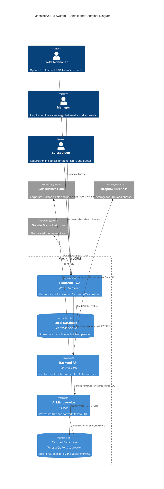

```mermaid
C4Context
    title MachineryCRM System - Context and Container Diagram

    Person(tech, "Field Technician", "Operates offline-first PWA for maintenance.")
    Person(manager, "Manager", "Requires online access to global metrics and approvals.")
    Person(sales, "Salesperson", "Requires online access to client history and quotes.")
    
    System_Boundary(crm_boundary, "MachineryCRM") {
        Container(pwa, "Frontend PWA", "React, TypeScript", "Responsive UI installed on field and office devices.")
        ContainerDb(sqlite, "Local Database", "SQLite/IndexedDB", "Stores data for offline technician operation.")
        Container(api, "Backend API", "C#, .NET Core", "Central point for business rules, Auth, and sync.")
        Container(ai, "AI Microservice", "Python", "Processes NLP and converts text to SQL.")
        ContainerDb(db, "Central Database", "PostgreSQL, PostGIS, pgvector", "Relational, geospatial, and vector storage.")
    }

    System_Ext(sap, "SAP Business One", "Corporate ERP for clients and parts.")
    System_Ext(dropbox, "Dropbox Business", "Storage for PDFs and photos.")
    System_Ext(maps, "Google Maps Platform", "Geolocated routing services.")

    Rel(tech, pwa, "Logs data offline via")
    Rel(manager, pwa, "Monitors metrics online via")
    Rel(sales, pwa, "Accesses client data online via")
    
    Rel(pwa, sqlite, "Reads/Writes (Offline)")
    Rel(pwa, api, "Authenticates & Syncs via REST (Online)")
    Rel(api, db, "Reads/Writes (SQL/EF Core)")
    Rel(api, ai, "Sends prompt, receives structured SQL")
    Rel(ai, db, "Performs vector similarity search")
    
    Rel(api, sap, "Consumes Service Layer API")
    Rel(api, dropbox, "Consumes OAuth API")
    Rel(pwa, maps, "Renders maps via JS API")
```