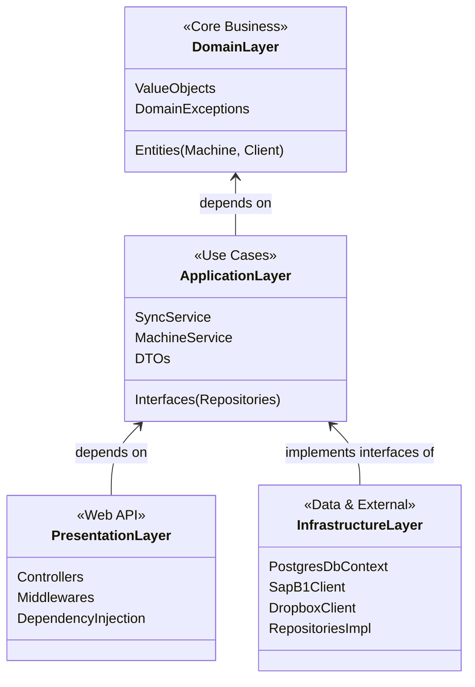

```mermaid
classDiagram
    direction BT

    class PresentationLayer {
        <<Web API>>
        Controllers
        Middlewares
        DependencyInjection
    }

    class InfrastructureLayer {
        <<Data & External>>
        PostgresDbContext
        SapB1Client
        DropboxClient
        RepositoriesImpl
    }

    class ApplicationLayer {
        <<Use Cases>>
        SyncService
        MachineService
        Interfaces (Repositories)
        DTOs
    }

    class DomainLayer {
        <<Core Business>>
        Entities (Machine, Client)
        ValueObjects
        DomainExceptions
    }

    PresentationLayer --> ApplicationLayer : depends on
    InfrastructureLayer --> ApplicationLayer : implements interfaces of
    ApplicationLayer --> DomainLayer : depends on
```