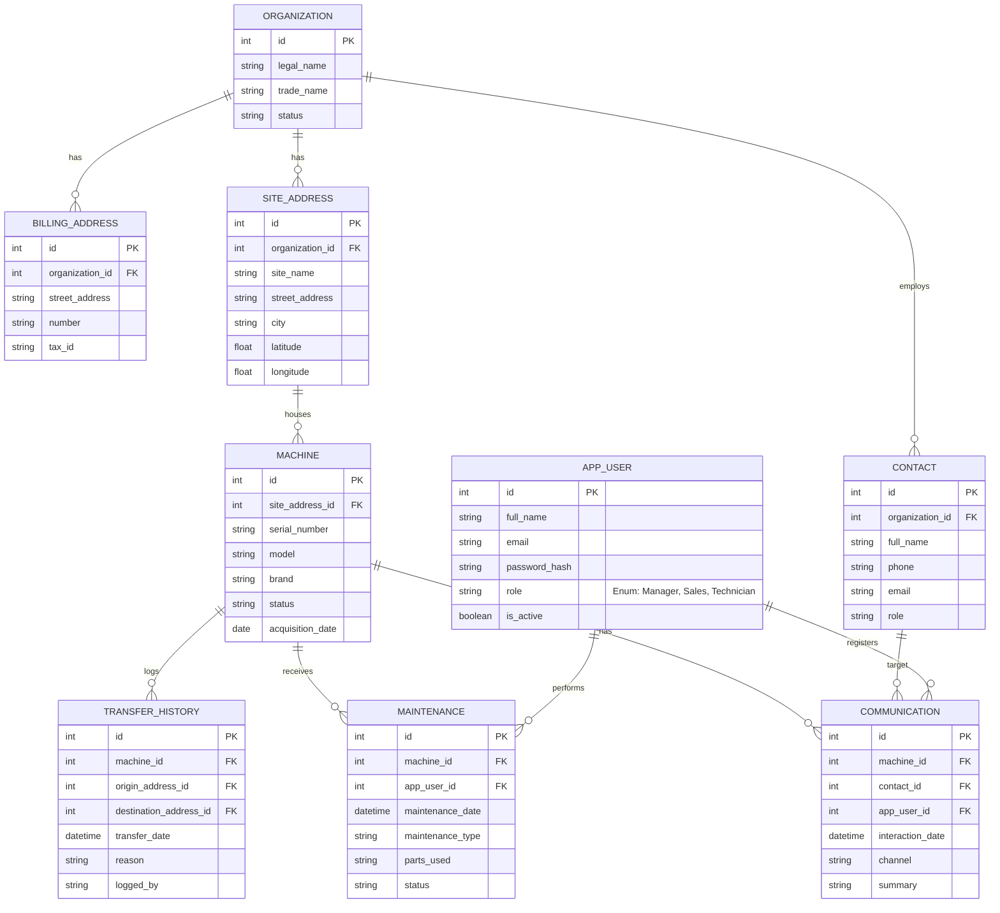

```mermaid
erDiagram
    ORGANIZATION ||--o{ BILLING_ADDRESS : has
    ORGANIZATION ||--o{ SITE_ADDRESS : has
    ORGANIZATION ||--o{ CONTACT : employs
    SITE_ADDRESS ||--o{ MACHINE : houses
    MACHINE ||--o{ TRANSFER_HISTORY : logs
    MACHINE ||--o{ MAINTENANCE : receives
    MACHINE ||--o{ COMMUNICATION : has
    CONTACT ||--o{ COMMUNICATION : target
    APP_USER ||--o{ MAINTENANCE : performs
    APP_USER ||--o{ COMMUNICATION : registers

    APP_USER {
        int id PK
        string full_name
        string email
        string password_hash
        string role "Enum: Manager, Sales, Technician"
        boolean is_active
    }

    ORGANIZATION {
        int id PK
        string legal_name
        string trade_name
        string status
    }

    BILLING_ADDRESS {
        int id PK
        int organization_id FK
        string street_address
        string number
        string tax_id
    }

    SITE_ADDRESS {
        int id PK
        int organization_id FK
        string site_name
        string street_address
        string city
        float latitude
        float longitude
    }

    CONTACT {
        int id PK
        int organization_id FK
        string full_name
        string phone
        string email
        string role
    }

    MACHINE {
        int id PK
        int site_address_id FK
        string serial_number
        string model
        string brand
        string status
        date acquisition_date
    }

    TRANSFER_HISTORY {
        int id PK
        int machine_id FK
        int origin_address_id FK
        int destination_address_id FK
        datetime transfer_date
        string reason
        string logged_by
    }

    MAINTENANCE {
        int id PK
        int machine_id FK
        int app_user_id FK
        datetime maintenance_date
        string maintenance_type
        string parts_used
        string status
    }

    COMMUNICATION {
        int id PK
        int machine_id FK
        int contact_id FK
        int app_user_id FK
        datetime interaction_date
        string channel
        string summary
    }
```