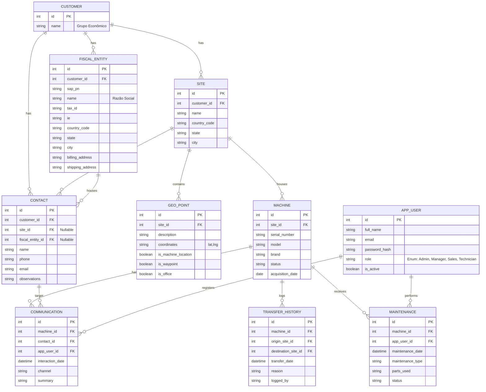

```mermaid
erDiagram
    CUSTOMER ||--o{ FISCAL_ENTITY : has
    CUSTOMER ||--o{ SITE : has
    CUSTOMER ||--o{ CONTACT : has
    SITE ||--o{ GEO_POINT : contains
    SITE ||--o{ CONTACT : houses
    FISCAL_ENTITY ||--o{ CONTACT : houses
    SITE ||--o{ MACHINE : houses
    MACHINE ||--o{ TRANSFER_HISTORY : logs
    MACHINE ||--o{ MAINTENANCE : receives
    MACHINE ||--o{ COMMUNICATION : has
    CONTACT ||--o{ COMMUNICATION : target
    APP_USER ||--o{ MAINTENANCE : performs
    APP_USER ||--o{ COMMUNICATION : registers

    APP_USER {
        int id PK
        string full_name
        string email
        string password_hash
        string role "Enum: Admin, Manager, Sales, Technician"
        boolean is_active
    }

    CUSTOMER {
        int id PK
        string name "Grupo Econômico"
    }

    FISCAL_ENTITY {
        int id PK
        int customer_id FK
        string sap_pn
        string name "Razão Social"
        string tax_id
        string ie
        string country_code
        string state
        string city
        string billing_address
        string shipping_address
    }

    SITE {
        int id PK
        int customer_id FK
        string name
        string country_code
        string state
        string city
    }
    
    GEO_POINT {
        int id PK
        int site_id FK
        string description
        string coordinates "lat,lng"
        boolean is_machine_location
        boolean is_waypoint
        boolean is_office
    }

    CONTACT {
        int id PK
        int customer_id FK
        int site_id FK "Nullable"
        int fiscal_entity_id FK "Nullable"
        string name
        string phone
        string email
        string observations
    }

    MACHINE {
        int id PK
        int site_id FK
        string serial_number
        string model
        string brand
        string status
        date acquisition_date
    }

    TRANSFER_HISTORY {
        int id PK
        int machine_id FK
        int origin_site_id FK
        int destination_site_id FK
        datetime transfer_date
        string reason
        string logged_by
    }

    MAINTENANCE {
        int id PK
        int machine_id FK
        int app_user_id FK
        datetime maintenance_date
        string maintenance_type
        string parts_used
        string status
    }

    COMMUNICATION {
        int id PK
        int machine_id FK
        int contact_id FK
        int app_user_id FK
        datetime interaction_date
        string channel
        string summary
    }
```