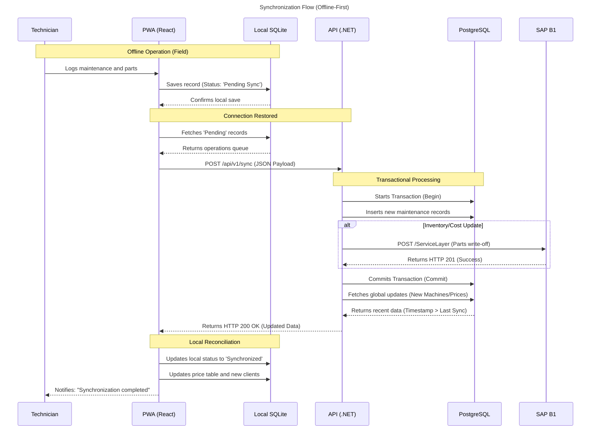

```mermaid
sequenceDiagram
    title Synchronization Flow (Offline-First)
    
    participant T as Technician
    participant P as PWA (React)
    participant L as Local SQLite
    participant A as API (.NET)
    participant D as PostgreSQL
    participant S as SAP B1

    Note over T,L: Offline Operation (Field)
    T->>P: Logs maintenance and parts
    P->>L: Saves record (Status: 'Pending Sync')
    L-->>P: Confirms local save
    
    Note over P,A: Connection Restored
    P->>L: Fetches 'Pending' records
    L-->>P: Returns operations queue
    P->>A: POST /api/v1/sync (JSON Payload)
    
    Note over A,D: Transactional Processing
    A->>D: Starts Transaction (Begin)
    A->>D: Inserts new maintenance records
    
    alt Inventory/Cost Update
        A->>S: POST /ServiceLayer (Parts write-off)
        S-->>A: Returns HTTP 201 (Success)
    end
    
    A->>D: Commits Transaction (Commit)
    A->>D: Fetches global updates (New Machines/Prices)
    D-->>A: Returns recent data (Timestamp > Last Sync)
    A-->>P: Returns HTTP 200 OK (Updated Data)
    
    Note over P,L: Local Reconciliation
    P->>L: Updates local status to 'Synchronized'
    P->>L: Updates price table and new clients
    P-->>T: Notifies: "Synchronization completed"
```